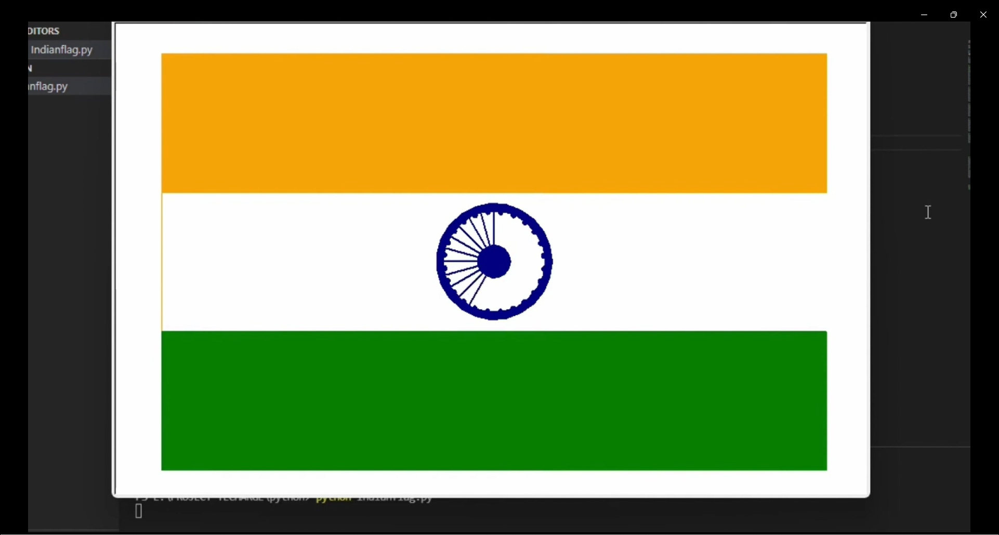
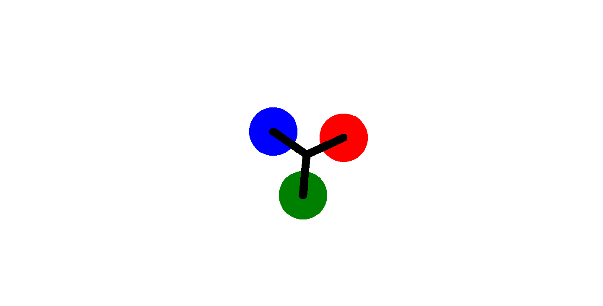
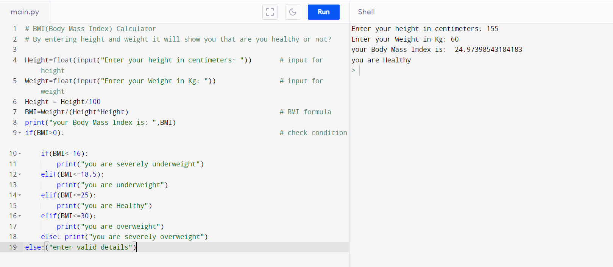
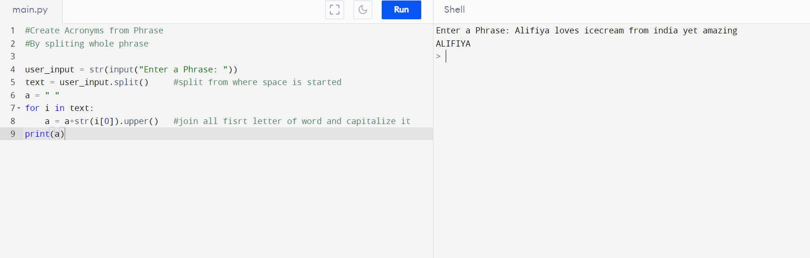
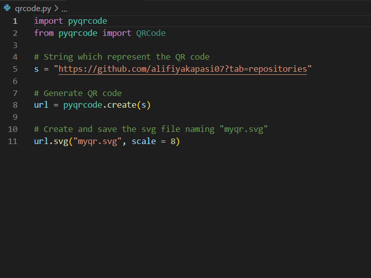
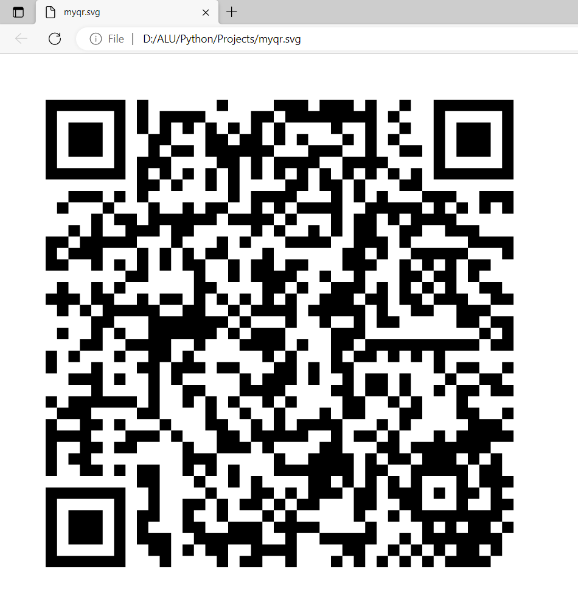
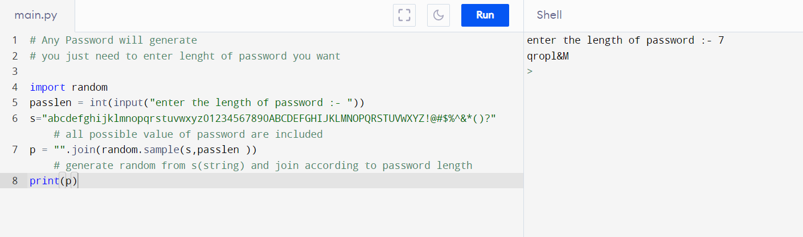

# Python_Projetcs

## Portfolio_Alifiya🔥
> https://alifiyakapasi07.github.io/Portfolio_Alifiya/

## Indian Flag 
 

## Draw Heart

## Fidget Spinner

## BMI_Calculator

## Create_Acronyms

## QR-Code
  

## Random Password Generator
 

## Features 📋
⚡️ Added comment where needed
⚡️ Easily written

## Tools Used 🛠️
* Python 
